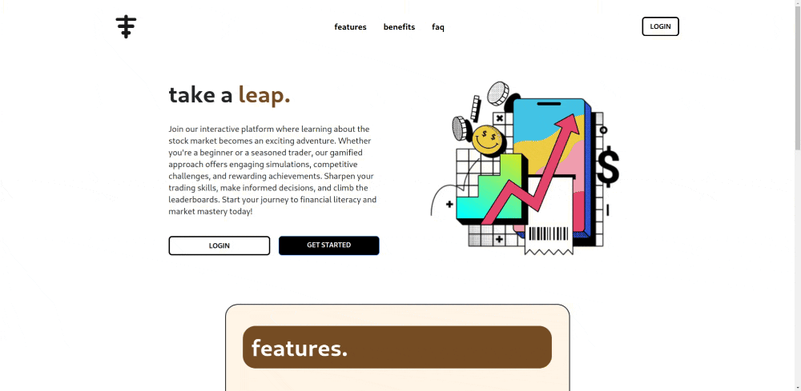
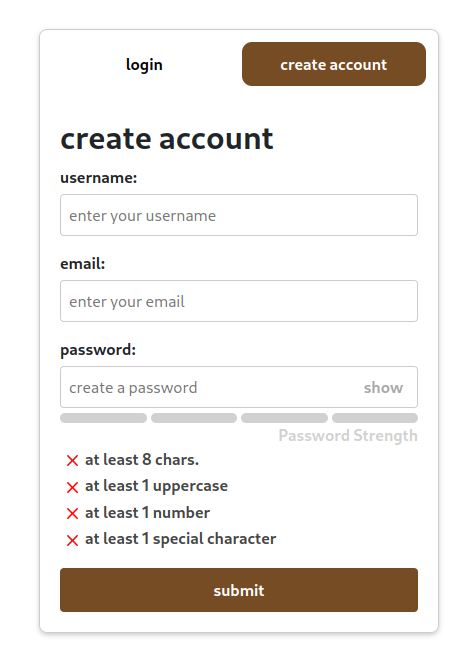
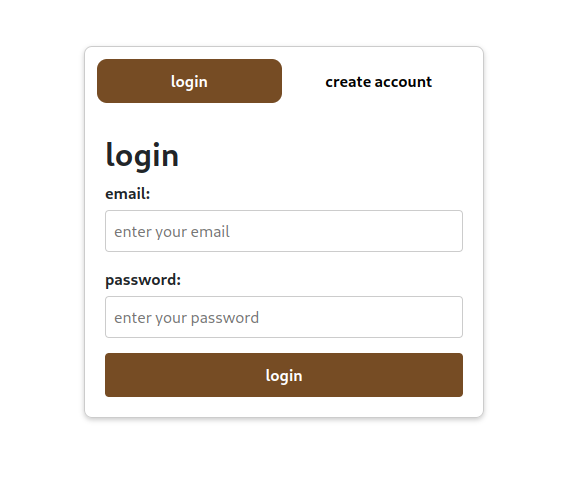

# ledgy

## overview

this is an alternative minimal trading journal currently in development.

## installation

```bash
git clone https://github.com/tkofb/ledgy.git
```

## usage

```bash
cd ledgy/

npm install

npm run dev
```

## status

currently i have completed development on the homepage and have started working on the design for each individual account and afterwards will start integration with Charles Schwab.

## visuals






## contributing

pull requests are welcome. for major changes, please open an issue first  
to discuss what you would like to change.  

please make sure to update tests as appropriate.  

## license

[MIT](https://choosealicense.com/licenses/mit/)